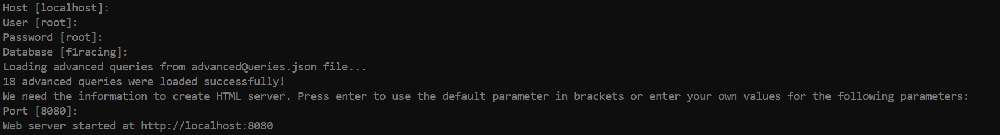

# F1 - The Official Home of Formula 1® Racing

**Course :** DataBase Organization (CS 425)

**Title :** F1 - The Official Home of Formula 1® Racing

This project focuses on showing and handling database for Formula 1. The database includes information on F1 drivers, teams, races, tracks, and race results. Built using Python and MySQL, it provides functionalities to query and manage data related to F1 awards, team names, racers, and more.

## Deployment

- Clone the repository 

```bash
  git clone https://github.com/HarshithDR/F1_DBO.git
```

- Install required packages

```bash
  pip install -r requirements.txt
```

- Setup MySql Database using the script 'table_creation.sql'
    
- Run the python server

```bash
  python server.py
```

- Enter the below parameters in the command line
    1. Host name
    2. User
    3. Password 
    4. Database name
    5. port number



- Go to the link http://localhost:8080

## Demo video

https://raw.githubusercontent.com/HarshithDR/F1_DBO/master/DemoVideo.mp4


## Contributors

1. Raviraj Mahadeo Khopade
2. Ramon Hernandez Garcia
3. Paula Pardo Pena
4. Harshith Deshalli Ravi
